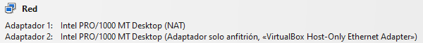
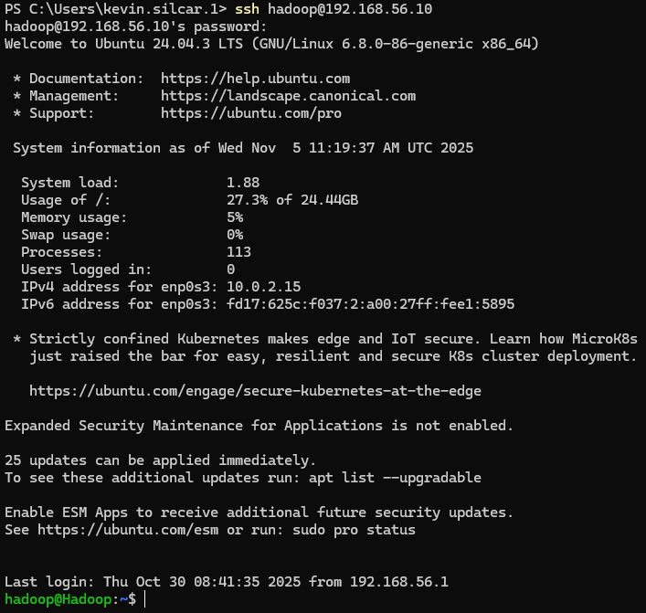
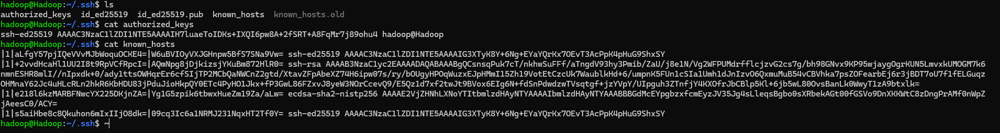
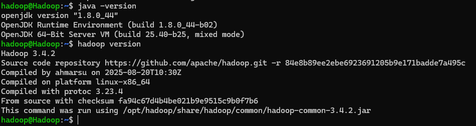
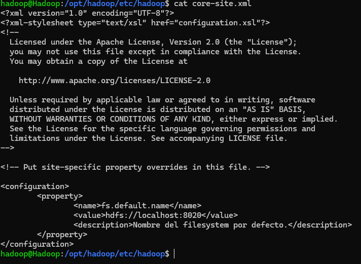
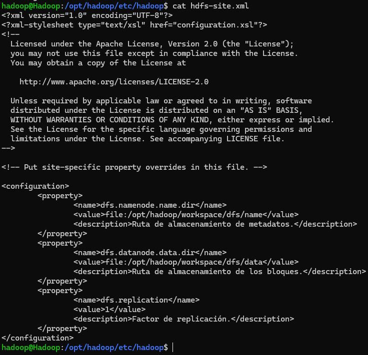
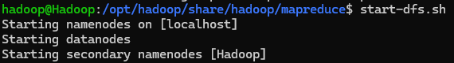
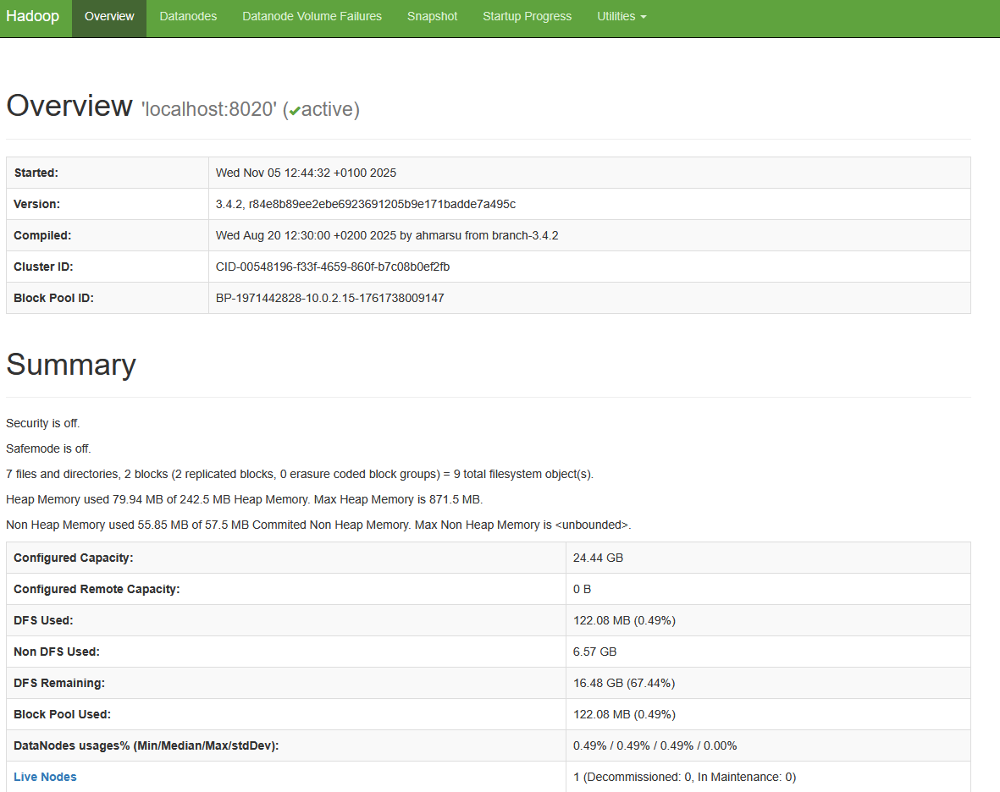
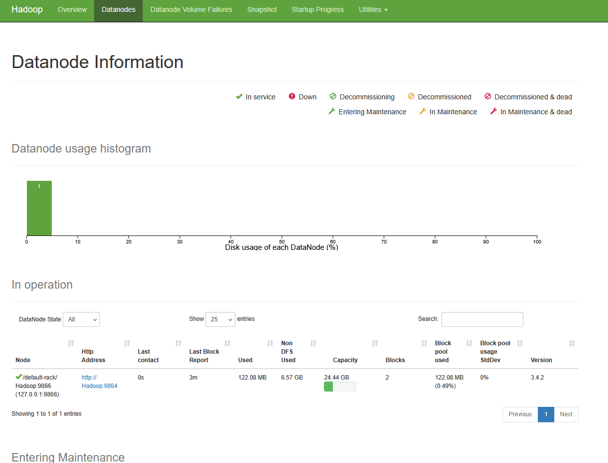
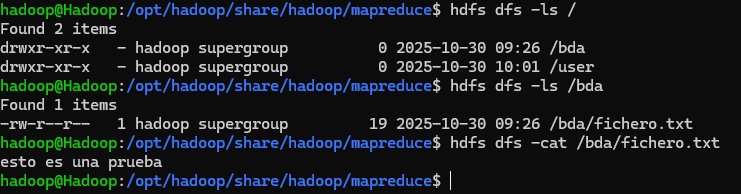

# PR0201: Instalación y configuración de Hadoop en modo pseudo-distribuido

## Configuración Máquina Virtual

### Adaptadores

La IP no puedo cambiarla porque estoy en un ordenador fijo.

### Configuración usuario y acceso SSH

Acceso por claves:

### Java y Hadoop

## Configuración Hadoop

### Ficheros de configuración

`core-site.xml`

`hdfs-site.xml`

## HDFS funcionando

`start-dfs.sh`

Interfaz web:

Comandos básicos:

[Volver](../index.md)