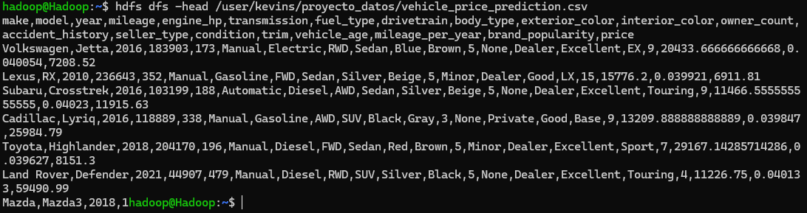
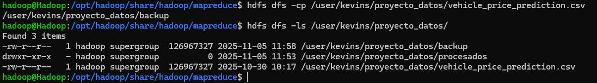
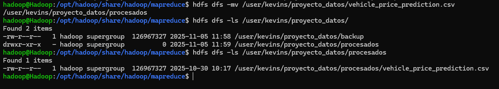

# PR0202: Uso del cliente HDFS

### Preparación del entorno
- Crea un directorio personal en HDFS bajo /user con tu nombre de usuario y dentro de él un directorio llamado proyecto_datos.
  
    `hdfs dfs -mkdir -p /user/kevins/proyecto_datos`

### Carga de datasets
- Descarga el dataset Automotive Price Prediction Dataset que puedes obtener desde Kaggle y que contiene un dataset sintético con información y precio de 1000000 de vehículos de segunda mano.
- Desde tu sistema local, sube al directorio proyecto_datos el dataset que has descargado.

Primero he descargado el fichero zip desde kaggle con `curl -L -o ~/vehicle-price-prediction.zip\
  https://www.kaggle.com/api/v1/datasets/download/metawave/vehicle-price-prediction`.

Después lo he descomprimido en local con `unzip vehicle-price-prediction.zip`.

Por último lo he movido al sistema distribuido con `hdfs dfs -put vehicle_price_prediction.csv /user/kevins/proyecto_datos`.

### Exploración de datos
- Visualiza el contenido del archivo directamente en HDFS.
- Obtén el número de líneas del dataset.

`hdfs dfs -head /user/kevins/proyecto_datos/vehicle_price_prediction.csv`

### Organización del proyecto
- Crea un subdirectorio procesados y otro backup dentro de tu carpeta de proyecto.
- Copia el archivo original a backup.
- Mueve el archivo original de proyecto_datos a procesados.

`hdfs dfs -mkdir /user/kevins/proyecto_datos/procesados`

`hdfs dfs -cp /user/kevins/proyecto_datos/vehicle_price_prediction.csv /user/kevins/proyecto_datos/backup`

`hdfs dfs -mv /user/kevins/proyecto_datos/vehicle_price_prediction.csv
/user/kevins/proyecto_datos/procesados`

### Colaboración en el equipo
- Crea un directorio compartido bajo /compartido (si no existe) y copia allí tu dataset para que otros puedan acceder.

### Recuperación de datos
- Descarga a tu sistema local el archivo que está en el directorio procesados.

### Control de accesos
- Verifica los permisos de tus archivos.
- Cambia los permisos de un archivo de backup para que solo tú tengas acceso de lectura y escritura.

### Mantenimiento
- Elimina un archivo temporal que hayas subido por error a tu espacio en HDFS.

### (Opcional, avanzado)
- Configura una cuota de número de archivos en tu directorio de proyecto y prueba a superar el límite para observar el comportamiento de HDFS.
