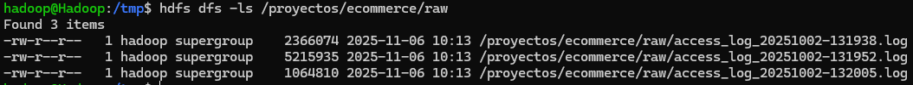
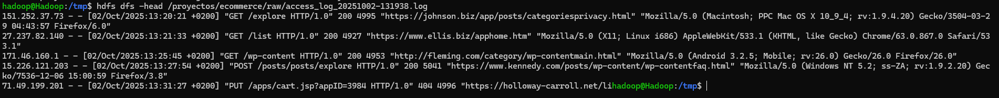
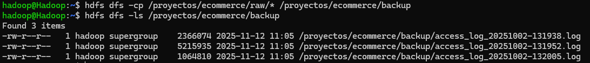
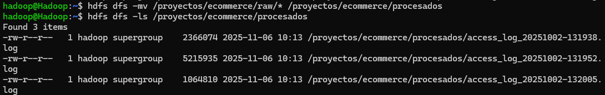
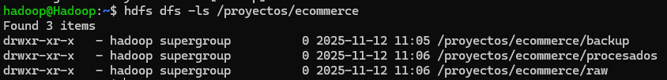
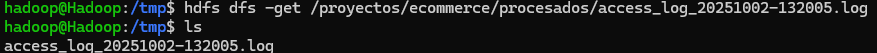
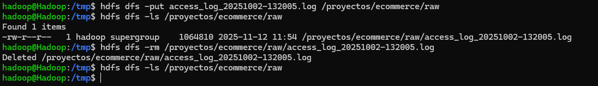

# PR0203: Uso del cliente HDFS (2)

### 1. Preparación el espacio de trabajo en HDFS

- Crea un directorio principal /proyectos/ecommerce en HDFS.
- Dentro de él, crea tres subdirectorios:
  - /raw → para los logs originales.
  - /procesados → para los logs ya tratados.
  - /backup → para copias de seguridad.

`hdfs dfs -mkdir -p /proyectos/ecommerce`

`hdfs dfs -mkdir /proyectos/ecommerce/raw`

`hdfs dfs -mkdir /proyectos/ecommerce/procesados`

`hdfs dfs -mkdir /proyectos/ecommerce/backup`

### 2. Carga inicial de logs
- Desde tu sistema local, sube al directorio /raw los siguientes logs de un servidor Web Apache:
    - Fichero de log 1
    - Fichero de log 2
    - Fichero de log 3

**Descarga**

`wget https://vgonzalez165.github.io/practicas_bigdata/practicas/bda/ut02/access_log_20251002-131938.log`

`wget https://vgonzalez165.github.io/practicas_bigdata/practicas/bda/ut02/access_log_20251002-131952.log`

`wget https://vgonzalez165.github.io/practicas_bigdata/practicas/bda/ut02/access_log_20251002-132005.log`

**Carga en HDFS**

`hdfs dfs -put access_log_* /proyectos/ecommerce/raw`

### 3. Inspección de datos
- Lista los archivos en /raw y visualiza su contenido.
- Muestra el número total de líneas en cada archivo subido.

`hdfs dfs -ls /proyetos/ecommerce/raw`

`hdfs dfs -head /proyectos/ecommerce/raw/access_log_20251002-131938.log`

### 4. Organización de los logs
- Copia los archivos de /raw a /backup.
- Mueve los archivos originales de /raw a /procesados.
  
`hdfs dfs -cp /proyectos/ecommerce/raw/* /proyectos/ecommerce/backup`

`hdfs dfs -mv /proyectos/ecommerce/raw/* /proyectos/ecommerce/procesados`

### 5. Acceso compartido para analistas
- Verifica los permisos actuales de /proyectos/ecommerce.
- Cambia los permisos de /procesados para que todos los usuarios tengan solo permisos de lectura, pero no de escritura ni eliminación.

`hdfs dfs -ls /proyecto/ecommerce`

`hdfs dfs -chmod 444 /proyectos/ecommerce/*`

### 6. Simulación de trabajo con analistas
- Descarga desde HDFS uno de los archivos de /procesados a tu sistema local para compartirlo externamente.

`hdfs dfs -get /proyectos/ecommerce/procesados/access_log_20251002-132005.log`

### 7. Mantenimiento y limpieza
- Sube un archivo temporal al directorio /raw.
- Elimínalo de HDFS para mantener el espacio limpio.

`hdfs dfs -put access_log_20251002-132005.log /proyectos/ecommerce/raw`

`hdfs dfs -rm /proyectos/ecommerce/raw/access_log_20251002-132005.log`

### 8. (Opcional, avanzado)
- Configura una cuota de espacio en /backup (ejemplo: 10 MB).
- Intenta subir archivos hasta alcanzar el límite y observa el comportamiento del sistema.

[Volver](../index.md)