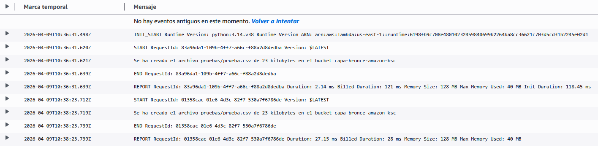
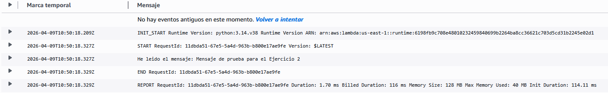
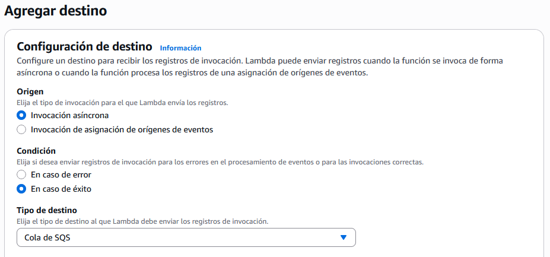
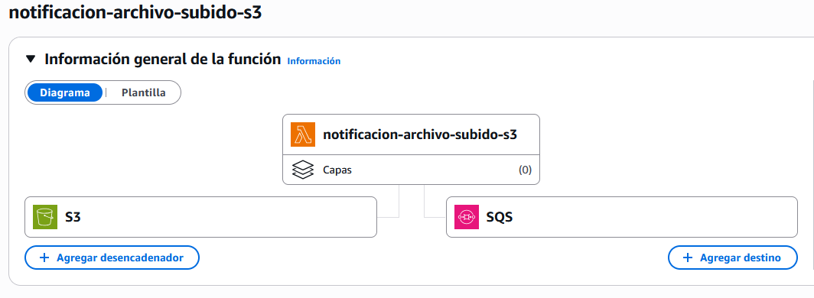
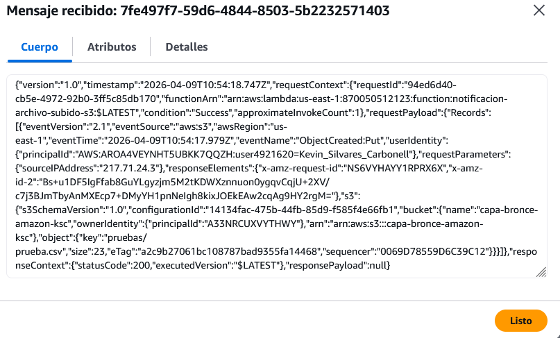
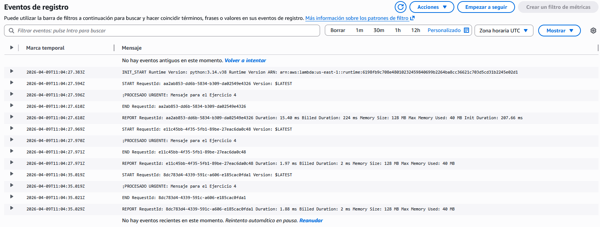

# PR0602 - AWS Lambda

## Instalació, importaciones y definiciones base 


```python
!pip install boto3

import boto3
import pandas as pd
import requests
import json
import datetime
from requests.exceptions import Timeout, RequestException

BUCKET = "capa-bronce-amazon-ksc"

def conectar_s3():
    try:
        s3 = boto3.client("s3")
        print("Conexión establecida.")
    except Exception as e:
        print("Error de conexión.")
        print(e)

    return s3

def subir_datos(s3, bucket, ruta, datos):
    buckets = [b["Name"] for b in s3.list_buckets().get("Buckets", [])]
    existe_bucket = bucket in buckets

    if not existe_bucket:
        s3.create_bucket(Bucket = bucket)

    s3.upload_file(datos, bucket, ruta)

    print(f"Dataframe subido con éxito a s3://{bucket}/{ruta}")
```

    Requirement already satisfied: boto3 in /opt/conda/lib/python3.11/site-packages (1.42.71)
    Requirement already satisfied: botocore<1.43.0,>=1.42.71 in /opt/conda/lib/python3.11/site-packages (from boto3) (1.42.71)
    Requirement already satisfied: jmespath<2.0.0,>=0.7.1 in /opt/conda/lib/python3.11/site-packages (from boto3) (1.1.0)
    Requirement already satisfied: s3transfer<0.17.0,>=0.16.0 in /opt/conda/lib/python3.11/site-packages (from boto3) (0.16.0)
    Requirement already satisfied: python-dateutil<3.0.0,>=2.1 in /opt/conda/lib/python3.11/site-packages (from botocore<1.43.0,>=1.42.71->boto3) (2.8.2)
    Requirement already satisfied: urllib3!=2.2.0,<3,>=1.25.4 in /opt/conda/lib/python3.11/site-packages (from botocore<1.43.0,>=1.42.71->boto3) (2.0.7)
    Requirement already satisfied: six>=1.5 in /opt/conda/lib/python3.11/site-packages (from python-dateutil<3.0.0,>=2.1->botocore<1.43.0,>=1.42.71->boto3) (1.16.0)


## Ejercicio 1

Crea una función Lambda que se dispare cada vez que se suba un archivo a un bucket de S3. Debe mostrar un mensaje con el siguiente texto:

```Se ha creado el archivo {nombre_archivo} de {tamaño_en_ks} kilobytes en el bucket {nombre_bucket}```

En AWS Lambda:
```python
import json

def lambda_handler(event, context):
    print(f"Se ha creado el archivo {event['Records'][0]['s3']['object']['key']} de {event['Records'][0]['s3']['object']['size']} kilobytes en el bucket {event['Records'][0]['s3']['bucket']['name']} ")
```


```python
d = {"col1": [1, 2], "col2": [3, 4]}
df = pd.DataFrame(data = d)

df.to_csv("df_prueba.csv")

s3 = conectar_s3()
subir_datos(s3, BUCKET, "pruebas/prueba.csv", "df_prueba.csv")
```

    Conexión establecida.
    Dataframe subido con éxito a s3://capa-bronce-amazon-ksc/pruebas/prueba.csv




## Ejercicio 2

Crea una función que se dispare cuando llegue un mensaje a la cola MiBuzon. La función debe imprimir:

`He leído el mensaje: {contenido_del_mensaje}".`

En AWS Lambda:
```python
import json

def lambda_handler(event, context):
    print(f"He leido el mensaje: {event['Records'][0]['body']}")
```



## Ejercicio 3

Modifica el primer ejercicio. Ahora, en lugar de imprimir solo por pantalla, la Lambda debe enviar los datos del archivo (nombre y tamaño) como un mensaje a una cola SQS llamada ColaDeProcesamiento.






```python
d = {"col1": [1, 2], "col2": [3, 4]}
df = pd.DataFrame(data = d)

df.to_csv("df_prueba.csv")

s3 = conectar_s3()
subir_datos(s3, BUCKET, "pruebas/prueba.csv", "df_prueba.csv")
```

    Conexión establecida.
    Dataframe subido con éxito a s3://capa-bronce-amazon-ksc/pruebas/prueba.csv




## Ejercicio 4

Envía un JSON a una cola SQS que contenga un campo `prioridad` y otro `mensaje`. Si la prioridad es `ALTA`, la Lambda debe imprimir: `¡PROCESANDO URGENTE: {mensaje}!`. Si es `BAJA`, debe imprimir: `Registro guardado para después.`

Para enviar manualmente un mensaje a una cola simplemente debes ir a Enviar y recibir mensajes de la propia cola.

En AWS Lambda:
```python
import json

def lambda_handler(event, context):
    prioridad = event["Records"][0]["messageAttributes"]["prioridad"]["stringValue"]
    mensaje = event["Records"][0]["body"]

    if prioridad == "ALTA":
        print(f"¡PROCESADO URGENTE: {mensaje}")
    elif prioridad == "BAJA":
        print(f"Registro guardado para después.")
```



## Ejercicio 5

Rehaz el ejercicio anterior enviando el mensaje desde un script Python en tu equipo.


```python
from botocore.config import Config

sqs = boto3.client('sqs', config = Config(region_name = "us-east-1"))

queue_url = 'https://sqs.us-east-1.amazonaws.com/870050512123/ColaDeProcesamiento'

datos_archivo = {
  "Records": [
    {
      "messageId": "cf44128b-6aab-40e1-9278-beca7c633161",
      "receiptHandle": "AQEBQzKOOymV7PuEMstETVSW13uqMujKog7noEikeqo2XuQP3QJ5GY/Hmig+CowVKA40juke/fInnKB0afN5e6LLp2RcahRHZkRTBbC7WPwhaJdQrVUfq8JfpD4mX9+4fwseg/jF+Htn7M005MBrxug+sAzBNiknkpBm4Wy3rUVloxesXsXqb9ZaaH/qIE+6tr/mNkuBobAD5g4bvE1/2bpNoIxXGslS5mlUmWNLnoZF2rFTtzRd3q6NAeKVmCYW3leVGgXwYnkJw1OPqoATW3Beo/4PJo5CtfN41UgdjmuX/M22W7Wxb601iMb0VGbKH5FToo1P8tOixdHilGsMz910M2CxW17YKP6L4qkz7CREJzBZeJldxhTxicL0ebIWUsWHI+vLdiwWozMkvhtZOWVJmA==",
      "body": "Mensaje para el Ejercicio 5",
      "attributes": {
        "ApproximateReceiveCount": "1",
        "SentTimestamp": "1775732358131",
        "SenderId": "AROA4VEYNHT5UBKK7QQZH:user4921620=Kevin_Silvares_Carbonell",
        "ApproximateFirstReceiveTimestamp": "1775732358140"
      },
      "messageAttributes": {
        "prioridad": {
          "stringValue": "ALTA",
          "stringListValues": [],
          "binaryListValues": [],
          "dataType": "String"
        }
      },
      "md5OfMessageAttributes": "c4e4d91a5fa8335e450537c4c88ee317",
      "md5OfBody": "6ebc36e7e20a77e5b4ccd3a35f63c1d2",
      "eventSource": "aws:sqs",
      "eventSourceARN": "arn:aws:sqs:us-east-1:870050512123:ColaDeProcesamiento",
      "awsRegion": "us-east-1"
    }
  ]
}

mensaje_serializado = json.dumps(datos_archivo)

response = sqs.send_message(
    QueueUrl = queue_url,
    MessageBody = mensaje_serializado
)

print("Mensaje enviado.")
```

    Mensaje enviado.


## Ejercicio 6

Crea una función Lambda que se ejecute todos los días a las 08:40 h que muestre el mensaje `Bienvenido a un nuevo día de clase`.
