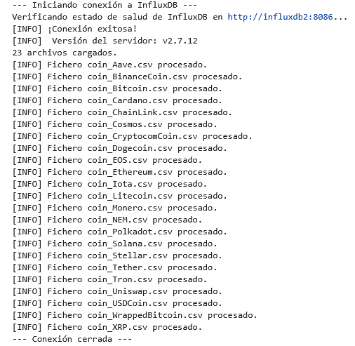
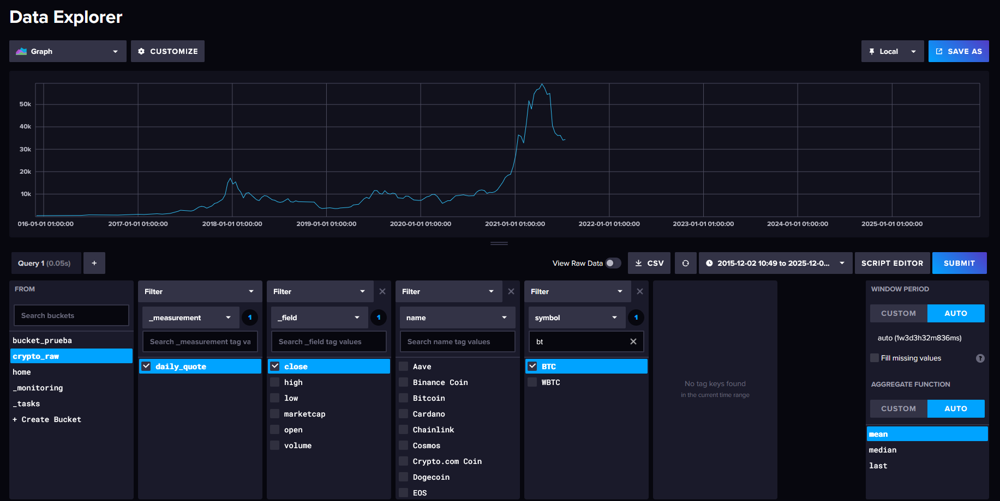

# PR0206: Ingesta de datos financieros en InfluxDB


```python
def list_files():
    try:
        crypto = os.listdir(CRYPTO_FILES_PATH)
        print(f"{len(crypto)} archivos cargados.")
        return crypto
    except FileNotFoundError:
        print("[ERROR]: Directorio no encontrado.")
```


```python
def write_points():
    for file in crypto_files:
        file_path = CRYPTO_FILES_PATH + file
        with open(file_path, mode = "r") as csvfile:
            csv_file = csv.DictReader(csvfile)
            for line in csv_file:
                p = Point("daily_quote") \
                    .tag("symbol", line["Symbol"]) \
                    .tag("name", line["Name"]) \
                    .field("close", float(line["Close"])) \
                    .field("high", float(line["High"])) \
                    .field("low", float(line["Low"])) \
                    .field("open",float( line["Open"])) \
                    .field("volume", float(line["Volume"])) \
                    .field("marketcap", float(line["Marketcap"])) \
                    .time(line["Date"])
            
                write_api.write(bucket = BUCKET, org = "docs", record = p)

            print(f"[INFO] Fichero {file} procesado.")
```


```python
import influxdb_client
from influxdb_client.client.write_api import ASYNCHRONOUS
from influxdb_client.client.exceptions import InfluxDBError
from influxdb_client import Point
from urllib3.exceptions import NewConnectionError
import os, csv

INFLUX_URL = "http://influxdb2:8086"
INFLUX_TOKEN = "MyInitialAdminToken0=="
BUCKET = "crypto_raw"

CRYPTO_FILES_PATH = "data/crypto_files/"
crypto_files = None

print("--- Iniciando conexión a InfluxDB ---")

client = None
try:
    # 1. Inicializar el cliente
    client = influxdb_client.InfluxDBClient(
        url=INFLUX_URL,
        token=INFLUX_TOKEN,
        org="docs"
    )

    # 2. Verificar la conexión con el servidor
    print(f"Verificando estado de salud de InfluxDB en {INFLUX_URL}...")
    health = client.health()
    
    if health.status == "pass":
        print("[INFO] ¡Conexión exitosa!")
        print(f"[INFO]  Versión del servidor: {health.version}")
        
        crypto_files = list_files()

        write_api = client.write_api(write_options = ASYNCHRONOUS)

        write_points()
    else:
        print(f"[ERROR] Conexión fallida. Estado: {health.status}")
        print(f"[INFO] Mensaje: {health.message}")

except (InfluxDBError, NewConnectionError) as e:
    print("[ERROR] Error al conectar con InfluxDB:")
    print(f"   Detalle: {e}")
    
finally:
    # 3. Es buena práctica cerrar siempre el cliente
    if write_api:
        write_api.close()
    if client:
        client.close()
        print("--- Conexión cerrada ---")
```

    --- Iniciando conexión a InfluxDB ---
    Verificando estado de salud de InfluxDB en http://influxdb2:8086...
    [INFO] ¡Conexión exitosa!
    [INFO]  Versión del servidor: v2.7.12
    23 archivos cargados.
    [INFO] Fichero coin_Aave.csv procesado.
    [INFO] Fichero coin_BinanceCoin.csv procesado.
    [INFO] Fichero coin_Bitcoin.csv procesado.
    [INFO] Fichero coin_Cardano.csv procesado.
    [INFO] Fichero coin_ChainLink.csv procesado.
    [INFO] Fichero coin_Cosmos.csv procesado.
    [INFO] Fichero coin_CryptocomCoin.csv procesado.
    [INFO] Fichero coin_Dogecoin.csv procesado.
    [INFO] Fichero coin_EOS.csv procesado.
    [INFO] Fichero coin_Ethereum.csv procesado.
    [INFO] Fichero coin_Iota.csv procesado.
    [INFO] Fichero coin_Litecoin.csv procesado.
    [INFO] Fichero coin_Monero.csv procesado.
    [INFO] Fichero coin_NEM.csv procesado.
    [INFO] Fichero coin_Polkadot.csv procesado.
    [INFO] Fichero coin_Solana.csv procesado.
    [INFO] Fichero coin_Stellar.csv procesado.
    [INFO] Fichero coin_Tether.csv procesado.
    [INFO] Fichero coin_Tron.csv procesado.
    [INFO] Fichero coin_Uniswap.csv procesado.
    [INFO] Fichero coin_USDCoin.csv procesado.
    [INFO] Fichero coin_WrappedBitcoin.csv procesado.
    [INFO] Fichero coin_XRP.csv procesado.
    --- Conexión cerrada ---

### Capturas



